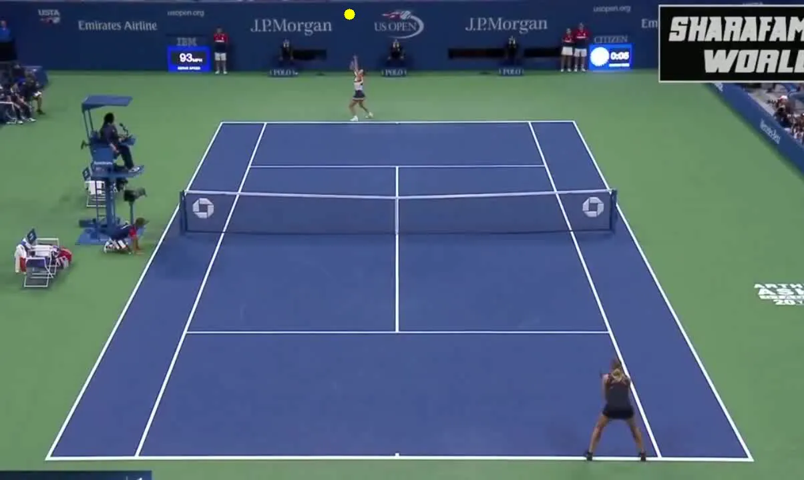
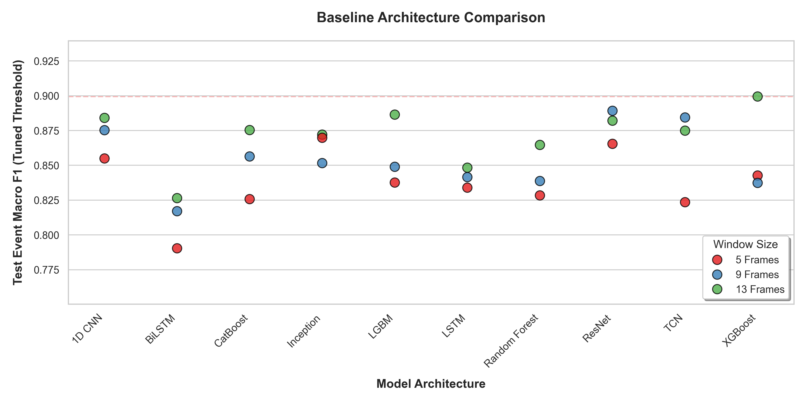
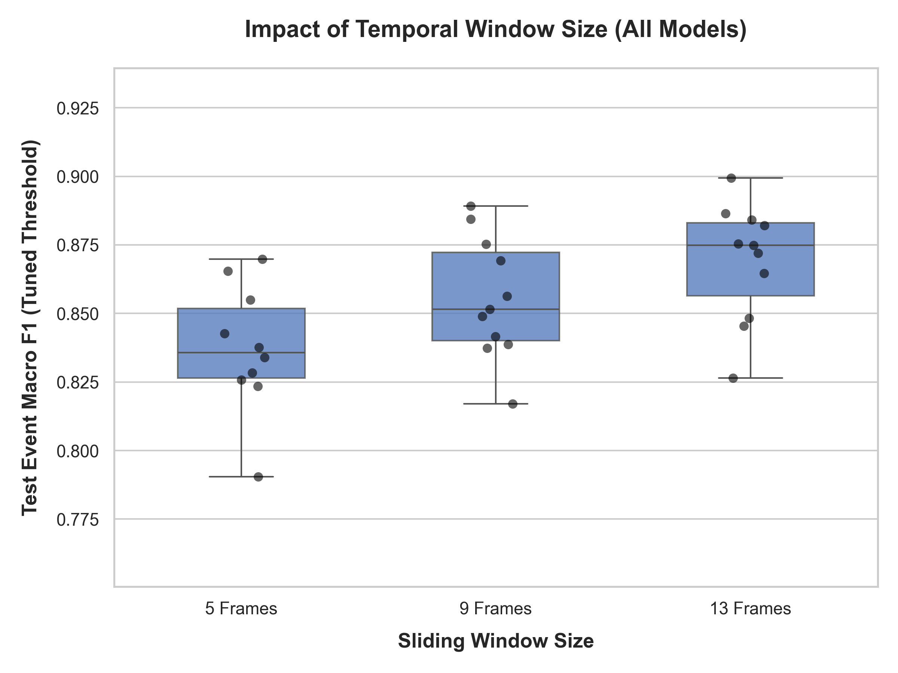
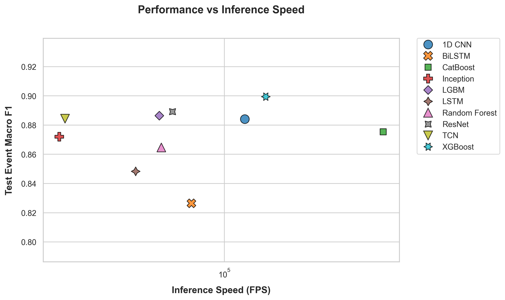
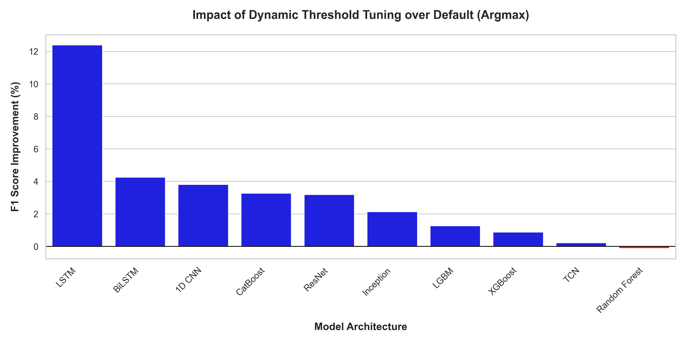

# Tennis Ball Event Detection

<p align="center">
  
</p>

This repository contains an end-to-end pipeline for detecting tennis ball events (hits and bounces) from 2D tracking coordinates. The goal of this research was to explore various neural network architectures, pipeline stages, and hyperparameter tuning methods to find the most robust configuration for event detection relying solely on ball coordinates.

> **🏆** Among all the architectures benchmarked, the **Single-Stage XGBoost** (using a 13-frame window) emerged as the best model, achieving a **0.899 Event Macro F1 Score** (and 0.990 Accuracy) at an inference speed of **151,000+ FPS**.

---

## Tech Stack
- **Deep Learning**: PyTorch
- **Machine Learning**: Scikit-Learn, XGBoost, CatBoost
- **Optimization & Tracking**: Optuna, CometML

---

## Methods

### Dataset
The dataset utilized for this research is available at [Dataset Repository](https://github.com/yastrebksv/TrackNet).

The data consists of raw 2D coordinate trajectories (`x`, `y`) extracted from a tennis match video, sampled at 30 FPS. To feed these into the models, a fixed-length temporal window is used. The ball status is encoded in `[Flying, Hit, Bounce]`.

Depending on the specific model architecture, the input consists of raw centered coordinates and relative kinematic features (such as velocity and acceleration).

### Dataset Split & Cross Validation
To ensure a robust evaluation and prevent data leakage, the dataset is strictly split by individual games rather than randomly shuffled:
- **Cross-Validation Set**: Games 1 through 8 are utilized in a strict 4-fold Cross-Validation (CV) scheme. This ensures that every configuration is thoroughly evaluated against multiple unseen games, preventing overfitting to any single validation split.
- **Hidden Test Set**: Games 9 & 10 (Strictly hidden until the final pipeline benchmark)

### Models Architecture
Several Deep Learning and Machine Learning architectures were benchmarked to determine the most effective topology for modeling 1D trajectory sequences:
- **Deep Learning**: 1D CNNs, LSTMs, BiLSTMs, TCNs, Inception 1D, ResNet 1D.
- **Machine Learning**: XGBoost, CatBoost, LGBM and Random Forest.

**Note on Transformers**: Transformers severely underperformed on this task, likely due to the small size of the dataset. Their global self-attention mechanisms struggled to model the highly localized kinematics required for sub-second event detection without significantly more training data.

### Windows
Temporal sliding window sizes of `5`, `9`, and `13` frames were benchmarked. A window that is too small lacks contextual physics, while a window that is too large introduces unnecessary background noise.

### Metrics and NMS
Because an event happens in a fraction of a second, models may predict an event 1 frame early or 1 frame late. To address this, Non-Maximum Suppression (NMS) with a temporal tolerance of 3 frames is implemented.

**Evaluation & Validation:**
- **Final Benchmark Metric**: The final performance is measured using the **Event Macro F1 Score** (the unweighted average of the Hit F1 and Bounce F1 scores).
- **Validation Metric**: During both standard training (for Early Stopping) and hyperparameter tuning, models are evaluated using their global AUC (Area Under the Curve) to assess their absolute probabilistic discriminative power prior to any thresholding.

**Dynamic Threshold Calculation:**
Rather than relying on a static `0.5` argmax, the final classification threshold is dynamically calibrated. We sweep across a linearly spaced probability grid (0.10 to 0.95) over the validation (or OOF) probabilities. The threshold that yields the maximum Peak F1 score is extracted and locked in as the optimal decision boundary for evaluating the unseen Test Set.

### 2 Stages
A **Two-Stage** pipeline is tested for the best models. Stage 1 detects anomalies (`Flying` vs `Event`). Stage 2 classifies the event (`Hit` vs `Bounce`). Instead of a hard threshold, predictions are mathematically blended using a zero-parameter Bayesian probability cascade.

### Optuna Tuning
Hyperparameter tuning is fully automated using a unified `tune.py` script backed by Optuna and SQLite. Both Machine Learning (e.g., XGBoost) and Deep Learning (e.g., ResNet) models are natively supported. To combat overfitting, the tuning pipeline automatically exports the parameters of the Top 3 most robust configurations (e.g., `configs/best_xgboost_top1.yaml`) to be validated on the hidden test set.

---

## Results

All experimental runs, hardware metrics, and learning curves were comprehensively tracked and logged using CometML: [Tennis Vision Ball Status (CometML)](https://www.comet.com/mtonell/tennis-vision-ball-event)

After systematically tuning the models via Optuna, the final benchmark evaluations on the unseen Test Set were performed. 

The final benchmark evaluation on the unseen Test Set revealed that the **XGBoost with a 13-frame window** achieved the best performance (**0.899 Event Macro F1**). Deep Learning models like ResNet also performed well.

<div align="center">

| Model | Window Size | Event Macro F1 | Inference Speed (FPS) |
|-------|:-----------:|:--------------:|:---------------------:|
| **XGBoost** | 13 | **0.899** | 151,098 |
| **ResNet** | 9 | **0.889** | 59,610 |
| **LGBM** | 13 | **0.886** | 52,271 |
| **TCN** | 9 | **0.884** | 20,413 |
| **1D CNN** | 13 | **0.884** | 122,601 |

</div>

**Architecture Performance Distribution**


*Figure 1: Distribution of Event Macro F1 scores across the baseline models, colored by sliding window size.*

**Window Size Performance**


*Figure 2: Impact of temporal sliding window size on performance. Aggregating across all models, 9 and 13-frame windows consistently provide the necessary physical context.*

**Performance vs Speed**


*Figure 3: A scatter plot comparing Inference Speed (FPS) against the Event Macro F1 score for the best configuration of each model. (Note the logarithmic X-axis)*

**Impact of Dynamic Threshold Tuning**


*Figure 4: The percentage improvement in Event Macro F1 score when utilizing the dynamic threshold sweep (instead of standard argmax) on the top configurations.*

---

**Pipeline Stages Complexity**

XGBoost and ResNet were tested with Bayesian Soft-Passing Two-Stage configurations.
The single-stage architecture significantly outperformed the two-stage cascade across all models (e.g., Single-Stage XGBoost scored 0.899, while Two-Stage XGBoost dropped to 0.845; Single-Stage ResNet scored 0.889, while Two-Stage ResNet dropped to 0.874). This proves that isolating the "Event Detection" step from the "Hit vs Bounce Classification" step destroys crucial spatio-temporal context that the model relies on to make accurate decisions.

### Optuna Tuning

**Tuning Results**: Interestingly, the strictly tuned Optuna models slightly underperformed their default baselines when evaluated on the hidden Test Set. This indicates that heavy parameter optimization easily overfits to the idiosyncratic visual characteristics of the Validation games due to the small total dataset size.

### Final Models

Two deployment models are established to cover different real-world input scenarios:

<div align="center">

| | **Model 1** | **Model 2** |
|---|---|---|
| **Architecture** | XGBoost | ResNet 1D |
| **Window** | 13 frames | 9 frames |
| **Input Features** | Kinematic derivatives (velocity & acceleration) | Raw ball coordinates (x, y) |
| **Event Macro F1** | **0.899** | **0.889** |
| **Accuracy** | **0.990** | **0.989** |
| **Inference Speed** | 151,098 FPS | 59,610 FPS |

</div>

- **Model 1 — XGBoost (Derivative Features)**: The primary model. It consumes hand-crafted first and second-order kinematic derivatives (Δx, Δy, Δ²x, Δ²y) computed from the raw coordinates. This model achieves the highest accuracy at lightning speed.

- **Model 2 — ResNet 1D (Raw Coordinates)**: The fallback model for pipelines where computing derivatives is impractical or where a smaller window size is needed. It ingests the raw `(x, y)` coordinate sequence directly over a 9-frame window and uses a deep residual 1D CNN to implicitly learn the kinematic patterns. Only marginally behind in accuracy, but still a strong standalone solution.

Both models are retrained using **100% of the available data** (Train + Validation + Test sets combined) to maximize exposure to the full range of game scenarios before live deployment.

---

## Instructions

### Core Entry Points
- `main.py`: **Grid Search Orchestrator** - loops over multiple configurations (e.g., `--model cnn resnet`).
- `train.py`: **Single Experiment Runner** - trains one specific configuration (e.g., `--model resnet`).
- `tune.py`: **Hyperparameter Optimizer** - uses Optuna to find the best configuration.
- `inference.py`: **Production Script** - predicts events from raw coordinates using saved weights.

### 0. Setup Dataset
1. Download the raw tracking dataset from the [Dataset Repository](https://github.com/yastrebksv/TrackNet).
2. Extract the contents into a root-level directory named `Dataset/`.
3. Run the filtering utility to extract the tracking coordinates:
   ```bash
   python scripts/dataset_filtering.py
   ```
   This script traverses the dataset and **completely ignores all the heavy image/video files**. It solely extracts the `Label.csv` coordinate files and consolidates them into a single lightweight `data/filtered_dataset.csv` file for ultra-fast training.


### 1. Evaluate Models
Evaluate the parameter configurations on the final Test Set:
```bash
python main.py --model xgboost resnet tcn --cv --metric auc --nms 3 --loss ce
```

### 2. Tune the Models
Run Bayesian Optimization for a specific model. Use the `--cv` flag to enable strict 4-fold Cross Validation.
```bash
python tune.py --model xgboost --trials 50 --cv
python tune.py --model resnet --trials 50
```

### 3. Train the Deployment Models
To train the final deployment model from scratch using the combined 100% dataset and your newly tuned parameters (set the number of epochs based on the validation phase, when needed):
```bash
python train.py --model xgboost --deploy --parameters configs/best_xgboost_top1.yaml --save --epochs 50
```

### 4. Live Inference
Generate predictions for a new match. Provide a CSV file containing `frame_num`, `x`, and `y` tracking coordinates.
```bash
python inference.py --input raw_tracking.csv --weights weights/final_xgboost_deploy.pkl --window 13 --nms 3
```
---

## Future Work

- **Model Ensemble**: Perform a soft-voting ensemble between models.
- **Trajectory Data Augmentation**: Improve the data augmentation for the training set, improving generalization and robustness of the models.
- **Contextual Spatial Features**: Currently, the model strictly relies on the ball's coordinates. Integrating spatial awareness, such as player bounding boxes or the ball's distance to the net, would provide the network with critical context to easily filter out False Positives.
- **Audio Feature Integration**: Incorporating audio features from the match video would create a highly robust multimodal pipeline. The distinct acoustic signature of a tennis ball striking a racket provides a completely orthogonal signal to resolve visually ambiguous cases.